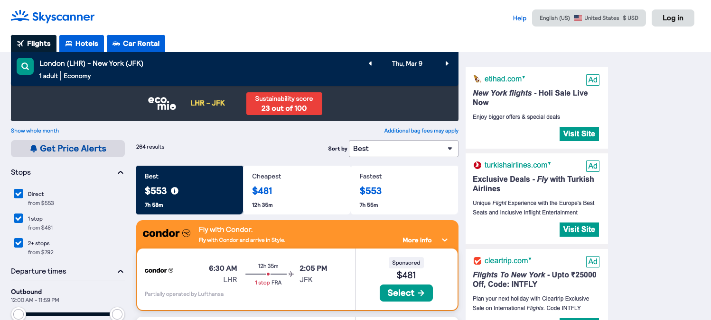
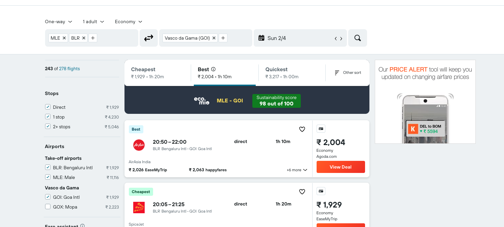

<!-- PROJECT LOGO -->
<br />
<p align="center">
    

  <h3 align="center">Ecomio extension</h3>

  <p align="center">
    Extension to track sustainability for flights on skyscanner & kayak
    <br />
    ·
    <a href="https://github.com/magnusfernandes/ecomio-extension-challenge/issues">Report Bug</a>
    ·
    <a href="https://github.com/magnusfernandes/ecomio-extension-challenge/issues">Request Feature</a>
  </p>
</p>

<!-- TABLE OF CONTENTS -->
<details open="open">
  <summary>Table of Contents</summary>
  <ol>
    <li>
      <a href="#about-the-project">About The Project</a>
      <ul>
        <li><a href="#built-with">Built With</a></li>
      </ul>
    </li>
    <li>
      <a href="#getting-started">Getting Started</a>
      <ul>
        <li><a href="#prerequisites">Prerequisites</a></li>
        <li><a href="#installation">Installation</a></li>
      </ul>
    </li>
    <li><a href="#roadmap">Roadmap</a></li>
    <li><a href="#contact">Contact</a></li>
    <li><a href="#acknowledgements">Acknowledgements</a></li>
  </ol>
</details>

<!-- ABOUT THE PROJECT -->

## About The Project

Tracks the trip destination and calculates the sustainability score for that trip.

- Reads origin, destination, start date & end date of users itinerary from [Kayak](kayak.com) & [Skyscanner](https://www.skyscanner.com/)
- Sustainability score is color coded.
  - [0-40] RED
  - [40-100] GREEN


<br />
<br />


### Built With

- [Typescript](https://www.typescriptlang.org/)
- [Sass](https://sass-lang.com/)

<!-- GETTING STARTED -->

## Getting Started

To get a local copy up and running follow these simple steps.

### Prerequisites

Require Node to run this project

- npm
  ```sh
  npm install npm@latest -g
  ```

### Installation

1. Clone the repo
   ```sh
   git clone git@github.com:magnusfernandes/ecomio-extension-challenge.git
   ```
2. Install NPM packages
   ```sh
   npm install
   ```
3. Execute the application
   ```JS
   npm run watch
   ```
4. Load extension in chrome browser

<!-- ROADMAP -->

## Roadmap

See the [open issues](https://github.com/magnusfernandes/ecomio-extension-challenge/issues) for a list of proposed features (and known issues).

<!-- CONTACT -->

## Contact

Magnus Fernandes - (magnusfernandes1295@gmail.com)

Project Link: [https://github.com/magnusfernandes/ecomio-extension-challenge.git](https://github.com/magnusfernandes/ecomio-extension-challenge.git)

<!-- ACKNOWLEDGEMENTS -->

## Acknowledgements

- [Typescript](https://www.typescriptlang.org/) : Used for error free code and faster developement
- [Sass](https://sass-lang.com/) : CSS pre-processor used for better structuring of the styles
- [Moment](https://momentjs.com/): Parse, validate, manipulate, and display dates.
